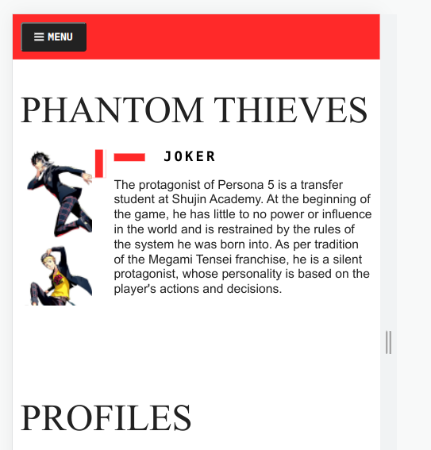
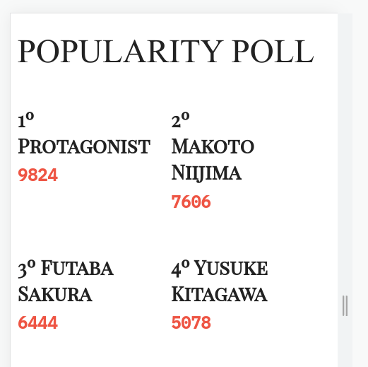
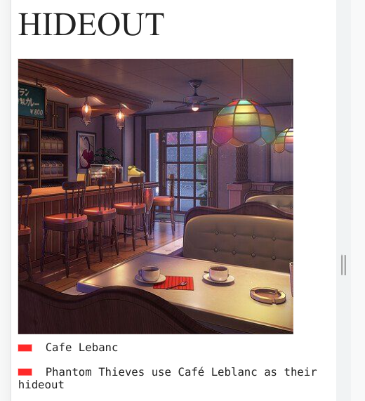

## Projeto do curso JS ES6 da Origamid
Esta projeto foi espalhado na página original realizado no curso de JS ES6 da Origamid.
Há a mudança e exclusão de algumas coisas além do tema da página ser diferente.

### Sobre
Este projeto tem como objetivo ser uma página tema do game Persona 5, trazendo informações sobre 
os protagonistas ([fonte](https://megamitensei.fandom.com/wiki/Phantom_Thieves_of_Hearts)).
 
#### Desktop

#### Mobile

### Tecnologias

